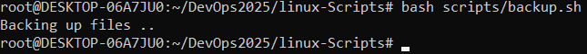
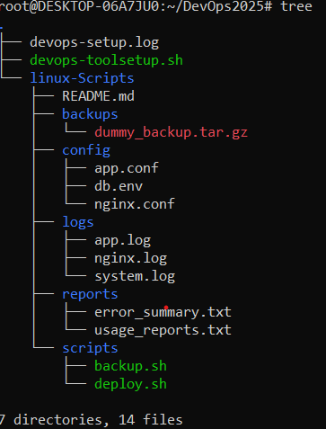
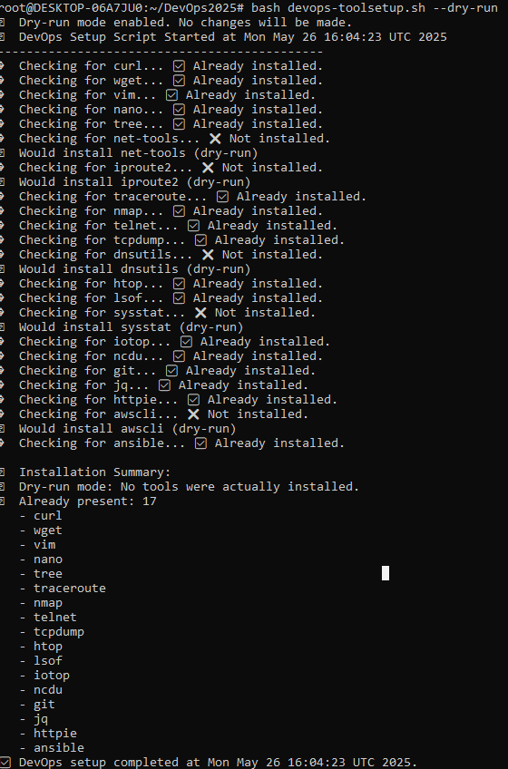

# 🚀 DevOps Setup Automation

This project showcases a hands-on Linux-based automation setup built using shell scripting. It includes two key components:

1. ✅ A **DevOps Tool Auto-Installer** script to set up essential packages.
2. 🛠️ A structured **Linux scripting project** demonstrating backup, logging, reporting, and config management .
---

## 📁 Folder Structure

Devops-Setup-automation/
├── devops-toolsetup.sh # Script to auto-install DevOps tools
├── devops-setup.log # Log file generated by the setup script
├── linux-Scripts/ # Structured Linux project
│ ├── backups/ # Contains backup files (e.g., tar.gz)
│ ├── config/ # Configuration files (app.conf, nginx.conf, etc.)
│ ├── logs/ # Log files (nginx.log, app.log, etc.)
│ ├── reports/ # Error and usage reports
│ └── scripts/ # Shell scripts like backup.sh, deploy.sh
├── screenshots/ # Visual previews for repo visitors
└── README.md # 📄 You're here!

---

## 🔧 DevOps Tool Auto-Installer

Script: [`devops-toolsetup.sh`](./devops-toolsetup.sh)

This shell script:
- Installs essential **DevOps**, **networking**, and **monitoring** tools
- Supports a `--dry-run` mode to simulate installation
- Logs all actions in `devops-setup.log`

### 🛠️ Tools It Installs

- **Basic Utilities**: `curl`, `wget`, `vim`, `nano`, `tree`
- **Networking**: `net-tools`, `iproute2`, `nmap`, `traceroute`, `telnet`, `tcpdump`
- **Monitoring**: `htop`, `lsof`, `sysstat`, `iotop`, `ncdu`
- **DevOps Tools**: `git`, `jq`, `httpie`, `awscli`, `ansible`

---

## 🗃️ Linux Scripts Project

Located inside [linux-Scripts](./linux-Scripts/)(./linux-Scripts/), this simulates a basic Linux system automation setup.

### Main Scripts
- `scripts/backup.sh` → Compress and archive files
- `scripts/deploy.sh` → Simulated deploy logic
- Uses `logs/`, `config/`, and `reports/` as input/output directories



---

## 📸 Screenshot Previews

### 📁 Folder Structure


### 🛠️ DevOps Tool Setup Overview


---

## ✅ How to Run

### 🖥️ Run the DevOps Setup Script

```bash
chmod +x devops-toolsetup.sh
./devops-toolsetup.sh

Or, to simulate a dry run:

./devops-toolsetup.sh --dry-run


---

📌 Key Highlights
Organized, modular folder structure

Follows best practices for script logging and idempotency

Screenshot-based README for visual walkthrough

Demonstrates automation logic for real-world DevOps scenarios

🤝 Let's Connect
Feel free to explore this repo! I'm passionate about automation, scripting, and building real-world DevOps solutions.
